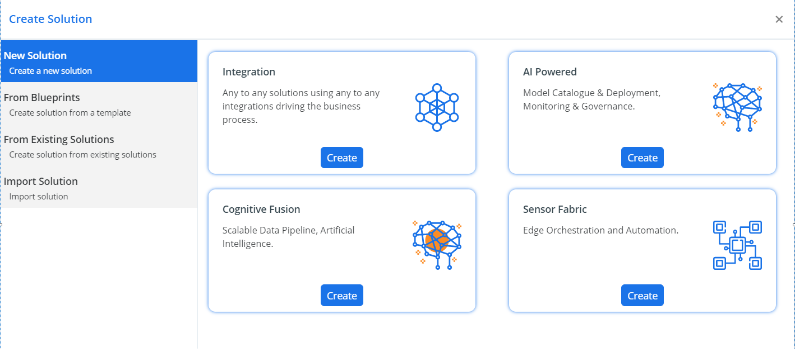

### createSolution page
   
 
  - **Web**. To make the code component available from any web browser, select the Web option next to the component. Notice that setting the Web option includes rendering the component in web browsers on PCs, Macs, and mobile devices.

   - **Phone**. To make the code component available on phones running Dynamics 365 for phones, select the Phone option next to the component.

   - **Tablet**. To make the code component available on tablet devices running Dynamics 365 for tablets, select the Tablet option next to the component.
   - **Bind to a static value**. Select the data type, such as a whole number (Whole.None), currency, floating point (FP), or decimal. Next, enter a number that represents the minimum accepted value for the field.  
  
       - **Bind to values on a field**. Select a field from the list that will be used as the minimum accepted value.  
  
   - **Max**. Set the maximum accepted value for the field. Similar to the Min value, you can bind a static value that you enter or bind the value to an existing field as described earlier. In this example, **Bind to static value** is **Currency** and the maximum value that can be entered is **1 billion**.  
  
   - **Step**. This represents the unit to increment or decrement when adding to or subtracting from  the current value. For example, for budget amount you can select 100 dollar increments\decrements.  
  
   - **Hide Default Control**. Hides the component so neither the component nor the data is displayed in any of the clients that don't support the code component.   
  
8. Select **OK**, to close the Field Properties page.  
  
9. To activate the customization, on the entity form select **Save**, and then select **Publish**.  
  
10. Select **Save and Close** to close the form editor.  
  
## Add code component to an entity

To add a code component like data-set component or simple table component to a grid or view, follow the steps below:

  - Navigate to **Settings > Customizations** and click on **Customize the System**.
  - Click on the arrow next to **Entities** tab a select the entity you want to add the code component. 
  - Click on the **Controls** tab and click on **Add a control**.
  - On the Add Control page, select the component that you want, such as Simple Table component and then select **Add**.
  - Choose the client where you want the component to appear.

## See the code component in action  

 Open a record that includes the field with the code component, such as the Opportunity form from the previous example, and view how the field is changed. The field is now rendered as a slider component instead of the text field.  
