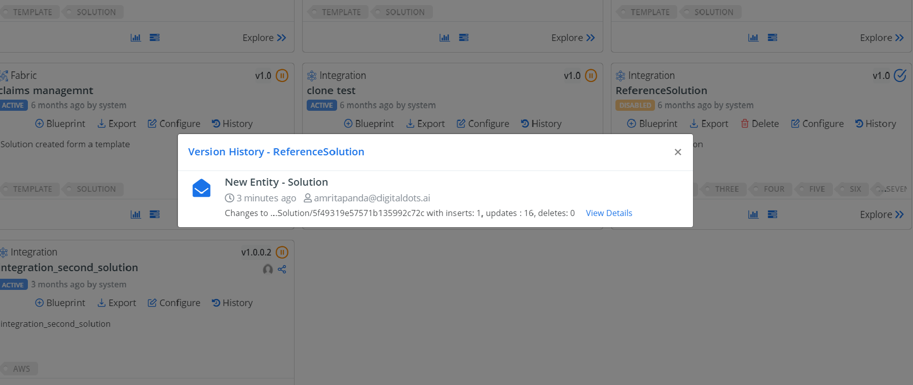

### Solution History
## Common elements and characteristics  
 Calculated and rollup attributes share some common elements and characteristics, for example:  
  
- They’re read-only.  
  
- They’re not specific to the user. The calculation is performed using a system user account, so the values may be based on records that the user doesn’t otherwise have privileges to view, such as attributes that have field-level security enabled.  
  
  All attributes that inherit from <xref:Microsoft.Xrm.Sdk.Metadata.AttributeMetadata> have a <xref:Microsoft.Xrm.Sdk.Metadata.AttributeMetadata.SourceType> property that can contain the values shown in the following table.  
  
|                 Value                 |                                    Description                                     |
|---------------------------------------|------------------------------------------------------------------------------------|
| Null |       Not a valid type of attribute to be a calculated or rollup attribute.        |
|                   0                   | Simple attribute. The attribute isn’t defined as a calculated or rollup attribute. |
|                   1                   |                                Calculated attribute                                |
|                   2                   |                                  Rollup attribute                                  |
  
 Calculated and rollup attributes are based on existing attribute types that inherit from <xref:Microsoft.Xrm.Sdk.Metadata.AttributeMetadata>. The following types of attributes have new properties:  
  
### Solution-history

